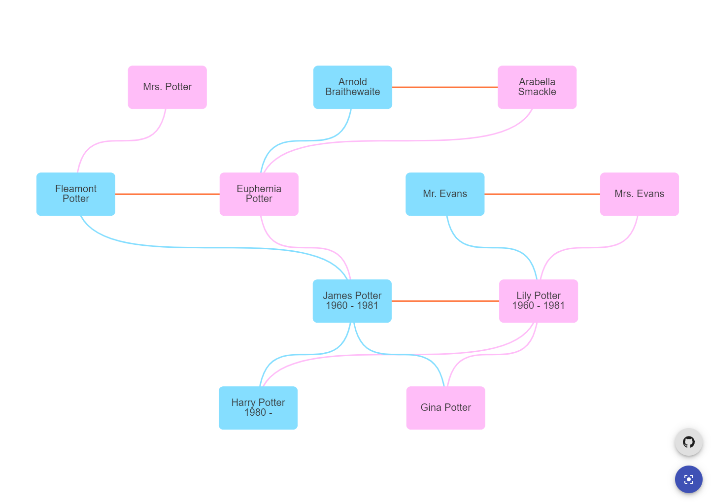

[](https://github.com/HarmanSran/family-tree/actions/workflows/test.yml)

# Overview

Uses [visjs network](https://visjs.github.io/vis-network/docs/network/) to render a family tree.

# Demo
Live demo: https://harmansran.github.io/family-tree/



# Forking
1. Clone this repository
2. Replace `<ROOT>/public/data/tree.json` (see [tree.json Structure](#structure))
3. Run:
```
<ROOT> npm install
<ROOT> npm start
```

## <a name="structure"></a> tree.json Structure
* Order does not matter (e.g. children before parents, or vice versa)
* Object with stringified integer keys, and object values with shape:
  * `name` (string), `relations` (object), `metadata` (object) - all three required
  * `relations` and `metadata` keys must at least be empty objects (i.e. `{}`)
* Available properties (all `relations` and `metadata` are optional)
```
{
  "ID": {
    "name": "<Name>",
    "relations": {
      "wife": <ID>,
      "husband": <ID>,
      "mother": <ID>,
      "father": <ID>
    },
    "metadata": {
      "gender": "<M|F>",
      "birth": "YYYY-MM-DD",
      "death": "YYYY-MM-DD",
      "description": "<Description>"
    }
  }
}
```

# Continuous Testing
Testing (jest) and linting (eslint) workflow configured out of the box (see `<ROOT>/.github/workflows/test.yml`).

# Manual Deployment
Github Pages deployment has already been configured and works out of the box.

To trigger a production build, and deploy to Github Pages, run:
```
<ROOT> npm deploy
```
Configure your URL for Github Pages in your repository's `Page` settings.